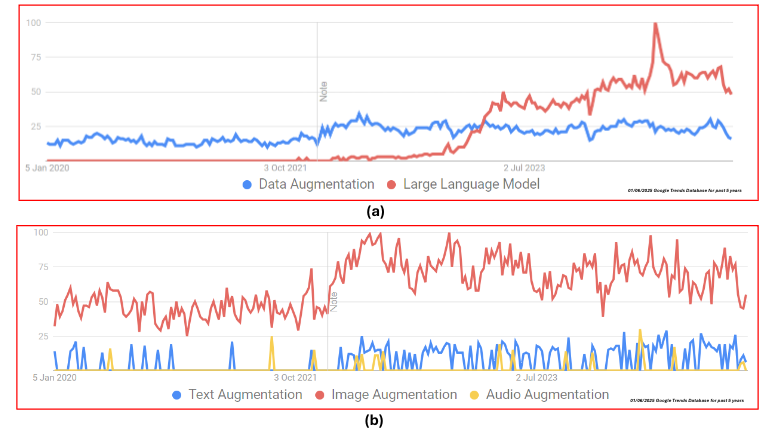

## Data-Aug-Multi-Modal-LLM  
# A Comprehensive Survey on Text, Audio, and Image Data Augmentation Using Multi-Modal LLMs for Deep Learning Applications

This repo contains all the relevant paper and information used in our study. This will be updated perodically as we revise our manuscript throughout the publication process.

The papers used in this study are organised and the links can be found below:

